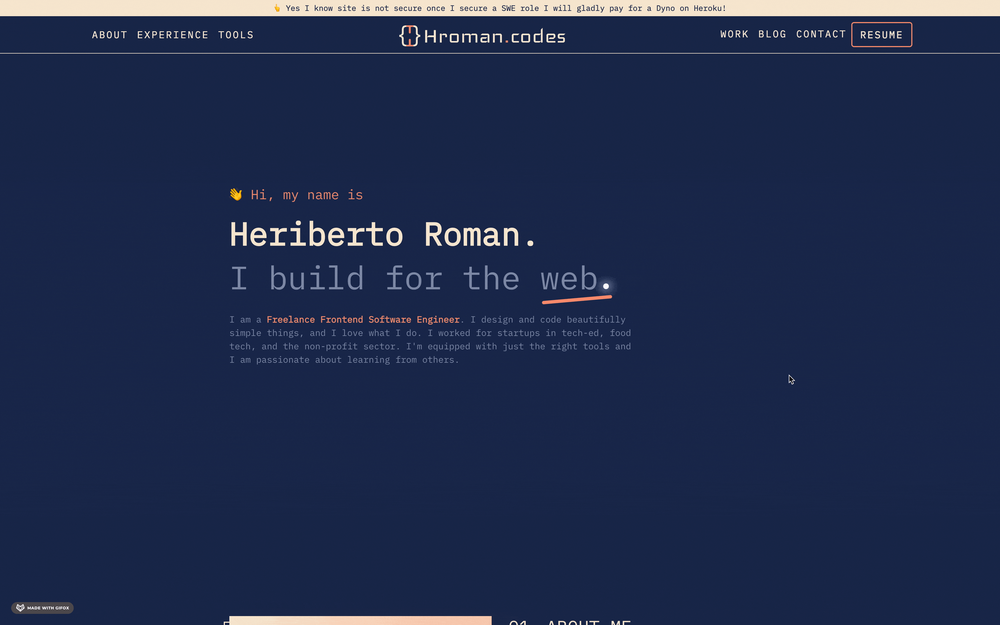

[](https://github.com/heriberto-codes/hrcodes/actions/workflows/fly-deploy.yml)
[](https://wakatime.com/badge/user/3a78d911-a08a-40c2-bf2c-782c4d20eb23/project/1682f28b-b9f7-452f-b0b2-e931f33d3524)



## Live Demo
[https://heriberto.codes](https://heriberto.codes)

## Process
##### ```Agile Software Development```
- [Trello](https://trello.com/b/yOVitfLV/hromancodes-portfolio-site)

##### ```Design & Prototyping```
- Figma
    - [Logo Design](https://www.figma.com/file/WEta53OsXH1s4ATRhpSkpQ/hroman_Codes?type=design&mode=design&t=2ZuafYJo6gH8xAhF-0)    

## Tech Stack
##### ```Scaffolding```
- HTML
- Django Template Language
##### ```Styling``` 
- CSS
- Bootstrap
##### ```Library```
- Django / Python
- Javascript
##### ```Deployment/Hosting Infrastructure```
- Heroku 
##### ```Animation```
- animate.css
